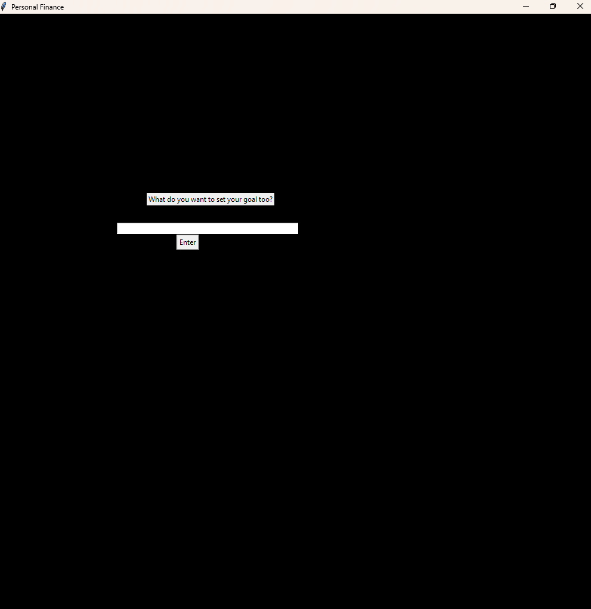

# Personal Finance Program(basic)
***

Run the program create an account and set a goal. After give us your income and we will help you budget the money based off of categories with only a few lines of personal information. 

## How to use
***
1. pip install matplotlib
2. pip install numpy
3. go to main
4. create an account
5. set goal
6. change income, and other values
7. logout and come back later to update

## Project features details
***
- 📊 Allows for the budgeting of your income 📊
- 🥅Allows for you to set savings goals🥅
- 🔥Allows multiple users🔥
- 🖼️Simple graphics 🖼️

## License information
***
No copyright

## Contributors
***
- guy-glitch
- flumph3927
- abstudent133
- BdzUcas
