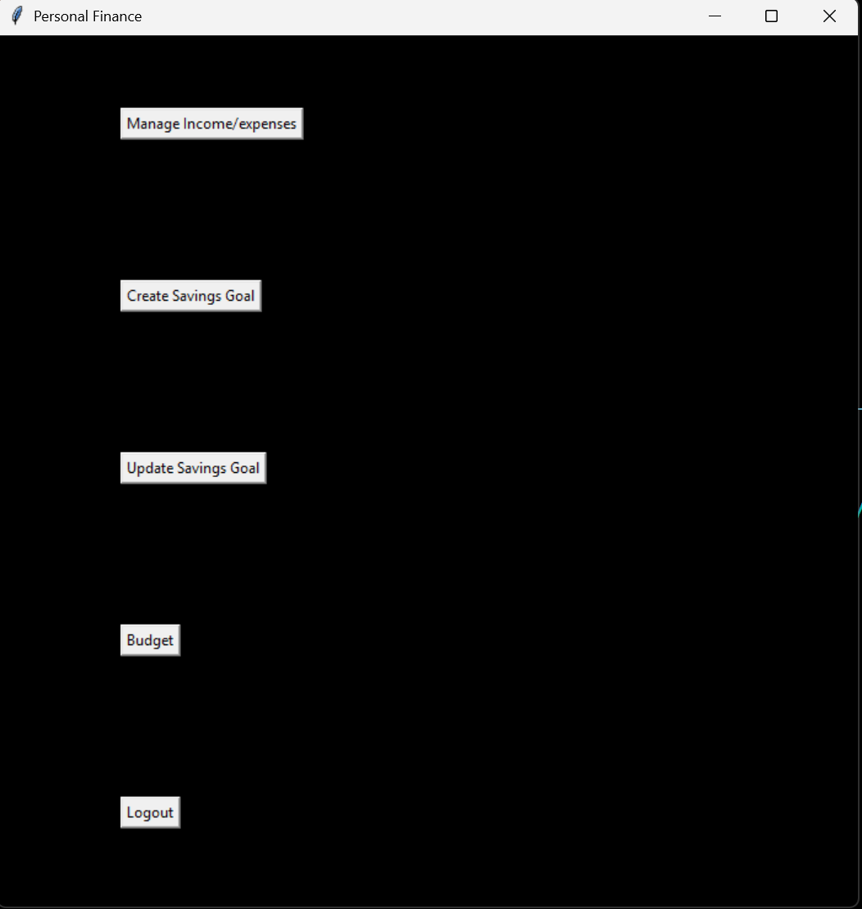

# Personal Finance Program
***

This is a personal finance program, where you can create an account to track income, savings, and goals. You can set up a budget with custom categories to properly manage your money. A simple interface with interactable buttons makes it easy to navigate.

## How to use
1. Open a new terminal and run the command: pip install matplotlib
2. Then run: pip install numpy
3. Run main.py
4. Choose login/create an account and then click create an account
5. set a goal
6. Experiment with changing values such as income
7. When you are done, choose logout and then quit. You can come back later and it will save your data.

## Project features details
- 📊 Allows for the budgeting of your income 📊
- 🥅Allows for you to set savings goals🥅
- 🔥Allows multiple users🔥
- 🖼️Simple graphics 🖼️

## License information
No copyright

## Contributors
- guy-glitch
- flumph3927
- abstudent133
- BdzUcas
